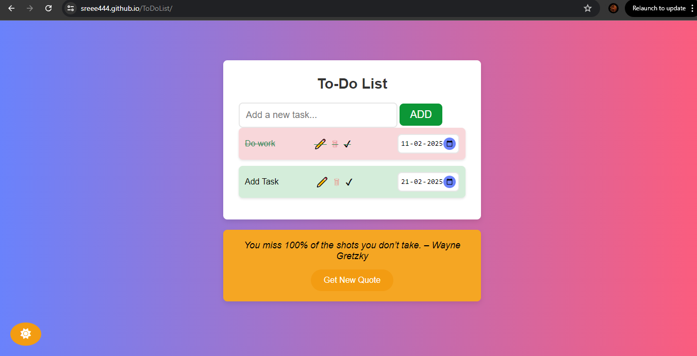
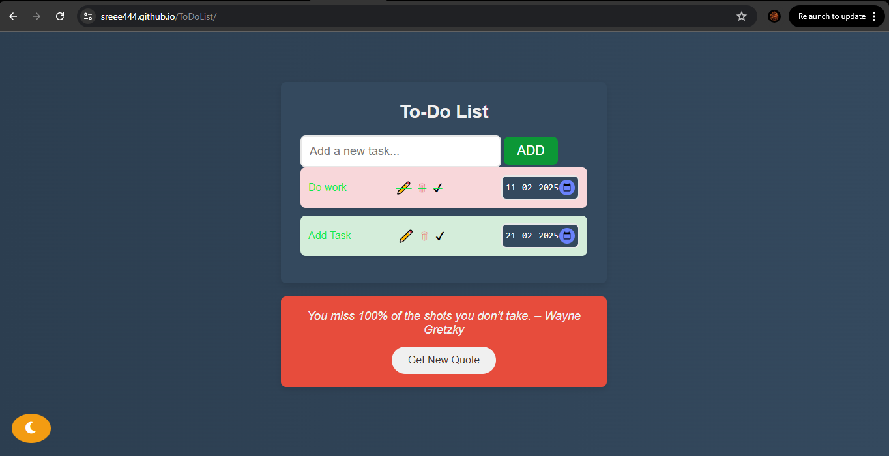

# To-Do List with Dark Mode

This is a simple and interactive **To-Do List** web application that allows users to add, edit, delete, and mark tasks as complete. The app also lets users set task due dates and visually prioritizes tasks based on the selected due date (overdue tasks are highlighted). Additionally, the app features a **dark mode toggle**, **random inspirational quotes**, and an attractive **user interface**.

## Features

### Task Management
- **Add Tasks**: Type a task in the input box and click the "ADD" button, or press Enter to add the task.
- **Edit Tasks**: Modify any task at any time using the pencil icon next to the task.
- **Delete Tasks**: Remove tasks from the list by clicking the trash icon.
- **Complete Tasks**: Tasks can be marked as complete by clicking the checkmark button. Completed tasks will have a line-through and a greenish background.

### Task Prioritization
- **Set Due Dates**: Users can set a due date for each task using the date picker. 
- **Color-coded Tasks**: Tasks will change color based on the due date:
  - **Overdue tasks** will have a light red background.
  - **Upcoming tasks** will have a light green background.
  
### Dark Mode
- **Dark Mode Toggle**: Switch between light and dark themes for a more comfortable viewing experience. The toggle button changes from a sun to a moon icon.

### Random Quote Generator
- **Inspiring Quotes**: Click the "Get New Quote" button to receive a new motivational quote, perfect for boosting your productivity.

## Technologies Used

- **HTML5**: The basic structure of the web page.
- **CSS3**: For styling and layout, including responsive design.
- **JavaScript (Vanilla)**: For adding interactivity like task management, dark mode toggle, and random quote generation.
- **Font Awesome**: For the icons used in the UI (edit, delete, sun/moon icons, etc.).

## Installation

1. **Clone this repository** to your local machine:
    ```bash
    git clone https://github.com/yourusername/to-do-list-dark-mode.git
    ```

2. **Navigate to the project directory**:
    ```bash
    cd to-do-list-dark-mode
    ```

3. **Open the `index.html` file** in your browser:
    - Double-click the `index.html` file to launch it in your default web browser, or drag and drop it into the browser window.

## Usage

### How to Use the To-Do List:
1. **Add a Task**:
   - Type your task in the input box at the top and press Enter or click the **ADD** button.
   
2. **Edit a Task**:
   - Click the **✏️** (edit) button next to any task to edit its text.
   
3. **Delete a Task**:
   - Click the **🗑** (delete) button next to the task to remove it from the list.
   
4. **Complete a Task**:
   - Click the **✔** (checkmark) button next to the task to mark it as complete. The task will be crossed out and given a green background.
   
5. **Set Task Due Dates**:
   - Select a date using the **date picker** next to each task. The task's background color will change based on whether the task is overdue or upcoming.

6. **Get a Random Quote**:
   - Click the **Get New Quote** button below the To-Do List to get a random motivational quote.
   
7. **Dark Mode**:
   - Toggle between dark and light mode by clicking the **sun/moon icon** at the bottom left of the page.

### Visual Elements
- The UI will dynamically adjust the background colors based on the theme (light/dark mode) and task priority (overdue or upcoming).
  
### Example Usage:
1. **Add a task**: `"Buy groceries"`
2. **Set the due date** to tomorrow.
3. **Complete the task** once done.
4. **Switch to dark mode** for a comfortable evening experience.
5. **Get a random quote** for motivation while working on tasks.

## Screenshots


> *An example of the To-Do List app in light mode with tasks and the quote generator.*


> *The To-Do List app in dark mode with tasks and dark theme styling.*

## Author

**Sreenandhu Jacy**

You can contact me at:

- **GitHub Profile**: [https://github.com/Sreenandhu](https://github.com/Sreee444)


## License

This project is licensed under the MIT License.

## Acknowledgments

- [Font Awesome](https://fontawesome.com) for providing the icons.
- The [Inspiration](https://www.brainyquote.com) for the motivational quotes.
- Special thanks to all contributors and open-source community for their support.

---


